# Caracalla-Thermen · Thermae Antoninianae

Eine begehbare 3D-Rekonstruktion der Caracalla-Thermen in Rom, wie sie um 216 n. Chr. ausgesehen haben könnten, in reinem Java mit eigenem Software-Renderer. Dampf, Wasser und Sonnenlicht sind animiert. Die Kamera kreist frei oder fliegt nach Drehbuch. Ein Zeitregler führt bis zur Ruine von heute.

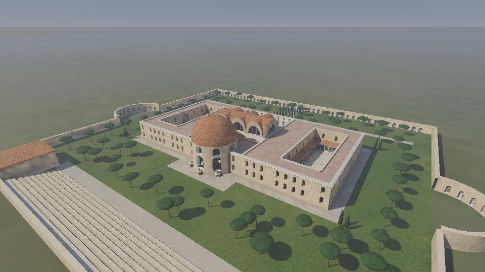

| | |
|---|---|
| 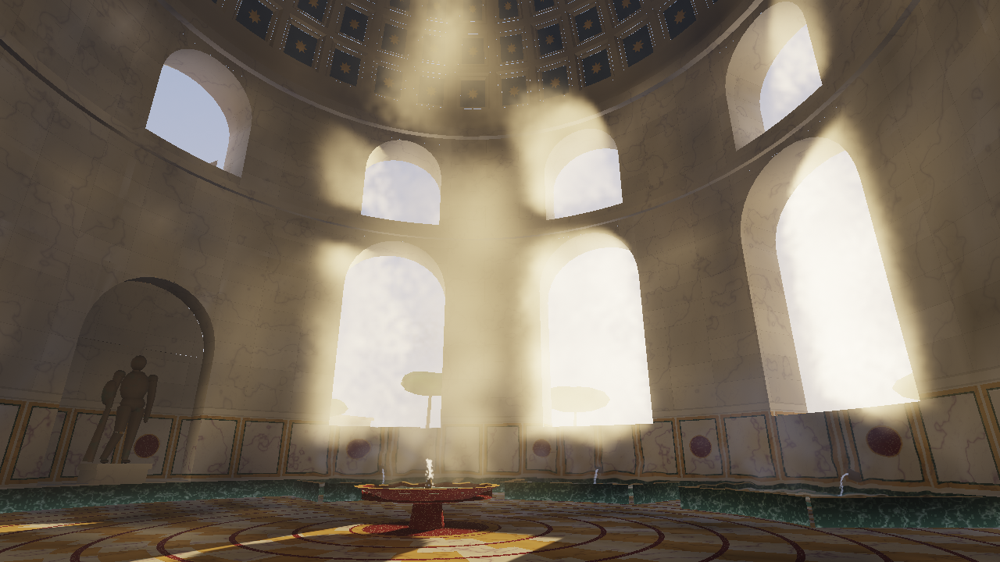 | 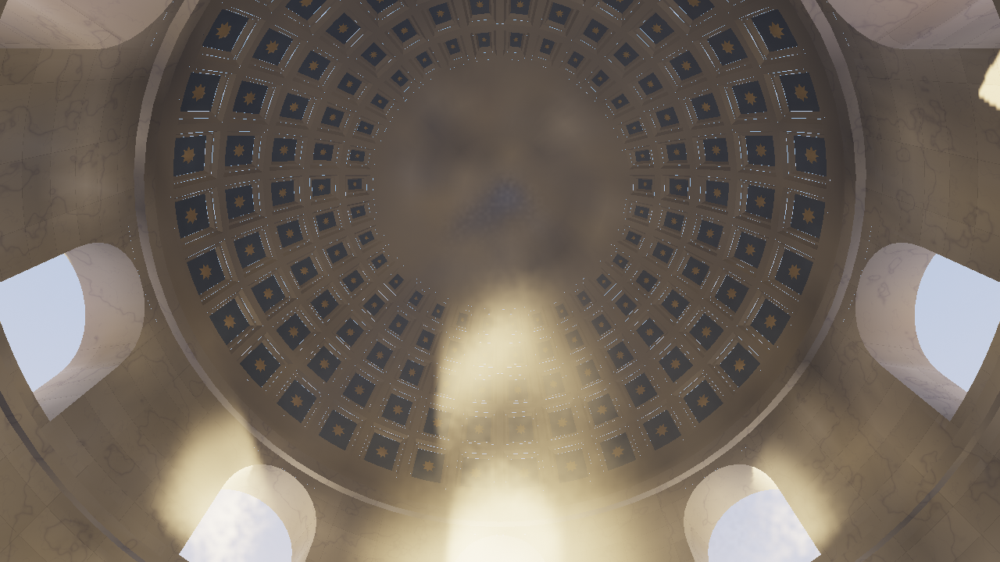 |
| Caldarium: Sonnenstrahlen im Dampf | Die Kassettenkuppel |
| 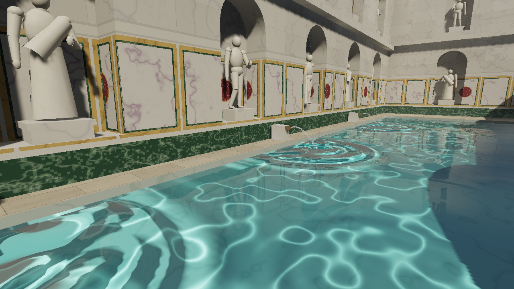 | 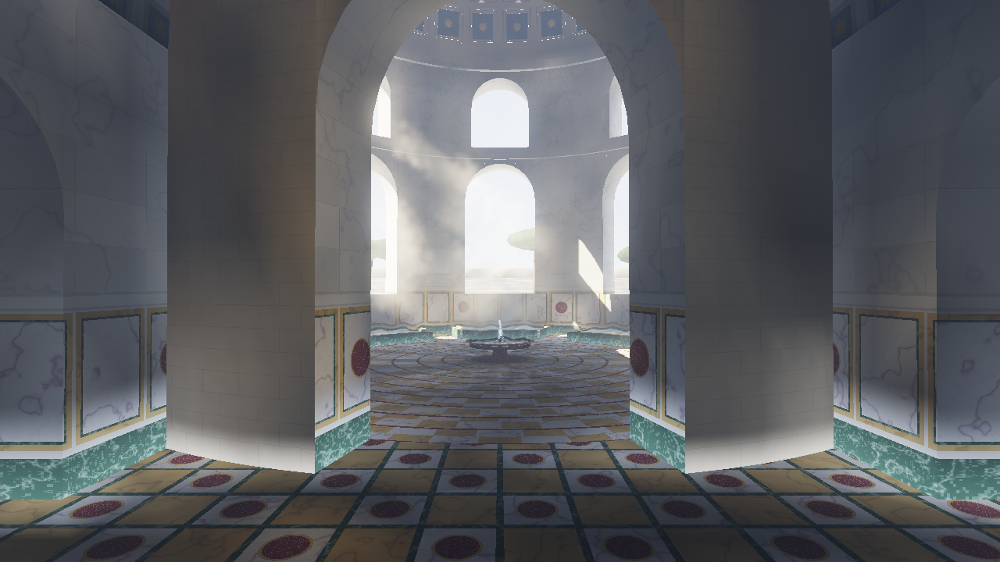 |
| Natatio: Wellen, Spiegelung, Lichtnetze | Frigidarium |

## Inhalt

- [Was die Szene kann](#was-die-szene-kann)
- [Zugaben](#zugaben)
- [Datenbank](#datenbank)
- [Bedienung](#bedienung)
- [Bauen und starten](#bauen-und-starten)
- [Technik](#technik)
- [Projektaufbau](#projektaufbau)
- [Zur Rekonstruktion und Quellen](#zur-rekonstruktion-und-quellen)

## Was die Szene kann

**Bau.** Der Zentralbau steht als parametrisches Modell nach dem überlieferten Grundriss: Natatio mit Schauwand, Frigidarium mit acht Granitsäulen und drei Kreuzgratgewölben, Tepidarium, das runde Caldarium mit Kassettenkuppel, beide Palästren. Dazu kommen Umfassung, Stadion über den Zisternen, Bibliotheken, Park mit Pinien und Zypressen, das Aquädukt und Hügel am Horizont. Dächer und Gewölbe lassen sich abnehmen.

**Stein.** Alle Materialien sind prozedural, ohne Bilddateien: Pavonazzetto, Giallo antico, Verde antico, Porphyr, Granit, Travertin, Opus sectile, Mosaiken, Ziegel. Hinzu kommen Kassettenrelief in den Gewölben und über 70 Statuen in den Nischen.

**Licht.** Die Sonne steht zu jedem Tag und jeder Uhrzeit richtig über Rom, in wahrer Ortszeit. Weitere Lichteffekte:

- zwei Schattenkarten
- Himmelslicht mit Verdeckung
- einmal zurückgeworfenes Licht
- volumetrische Strahlen durch die Fenster
- Bloom und Belichtungsautomatik
- Zeitraffer und dunstiges Wetter

**Wasser.** Jedes Becken hat seine eigene Wellensimulation. Dazu gehören:

- Spiegelung im Bild
- Brechung auf den Beckenboden
- wandernde Lichtnetze
- ein Labrum mit Fontäne und zehn Wasserspeier

Ein Klick ins Wasser wirft einen Stein.

**Dampf.** Bis zu 26 000 Teilchen steigen über den warmen Becken auf, sammeln sich unter der Kuppel und ziehen durch die Fenster ab. In ihnen leuchten die Sonnenstrahlen auf, über den heißen Wannen flimmert die Luft, und morgens liegt Nebel über der Natatio.

**Regie.** Es gibt vier Kamerafahrten und einen Rundgang in der römischen Badefolge mit Tafeln. Das Drehbuch „Ein Tag in den Thermen“ dauert knapp vier Minuten, vom Sonnenaufgang bis zur Dämmerung, mit einer Zeitleiste zum Springen.

| | |
|---|---|
| 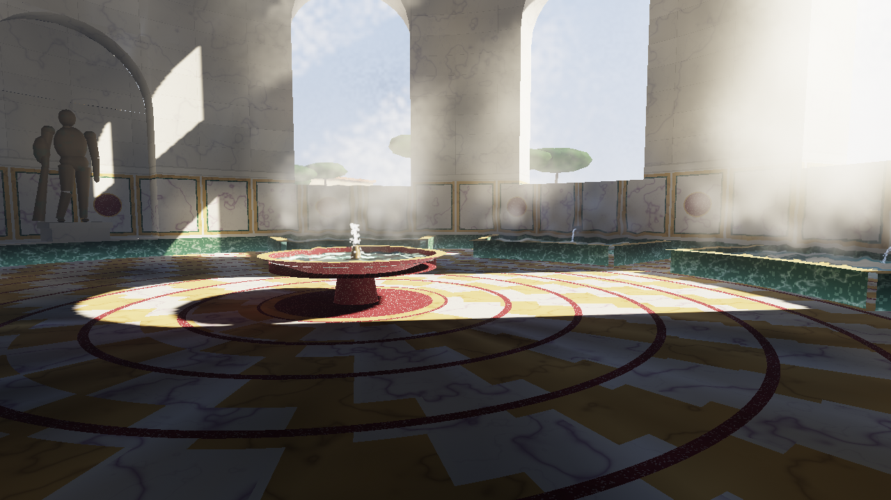 | 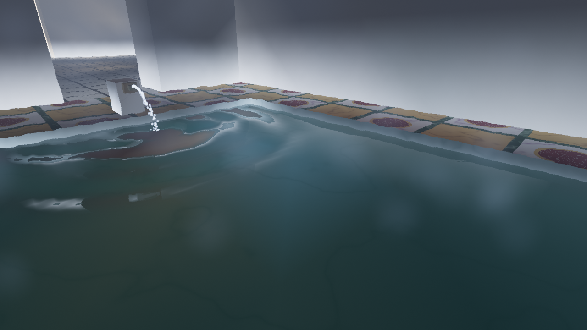 |
| 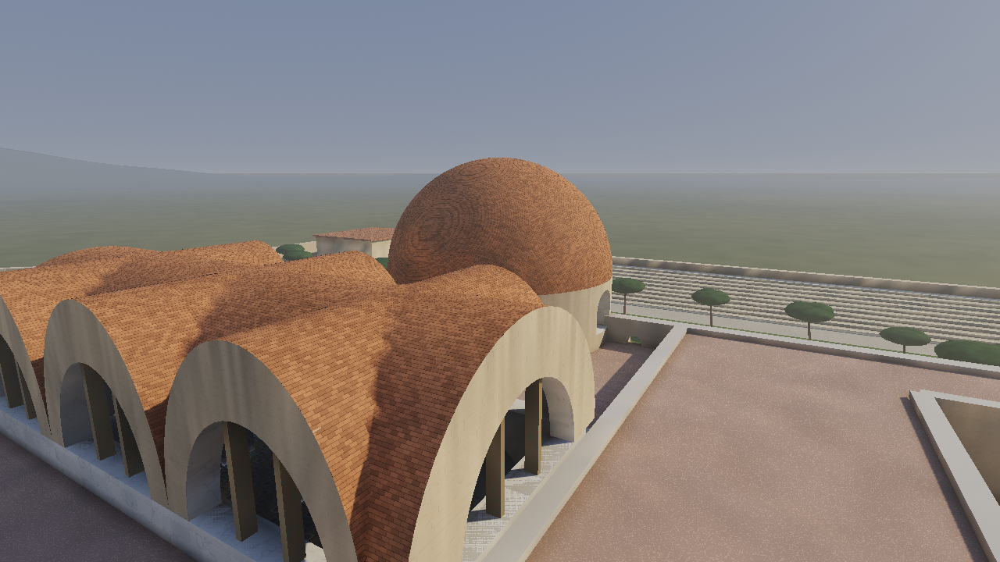 | 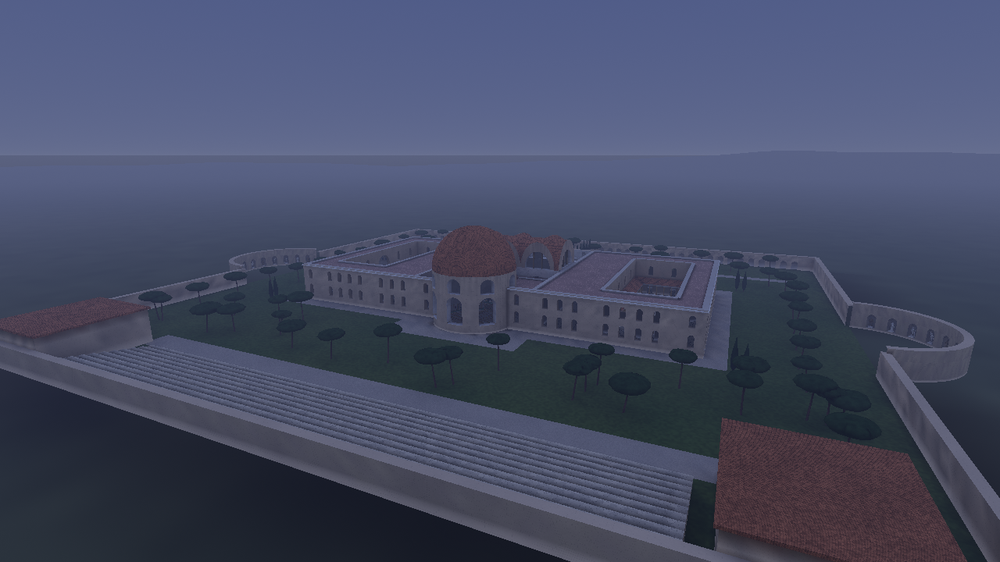 |

## Zugaben

**Schnitt mit Hypokaustum.** Der Schnitt öffnet den Zentralbau an einer verschiebbaren Ebene. Unter den warmen Sälen glühen rund 1400 Ziegelpfeiler. Heißluft zieht vom Praefurnium unter den Boden und steigt in den Wandröhren auf.

| | |
|---|---|
| 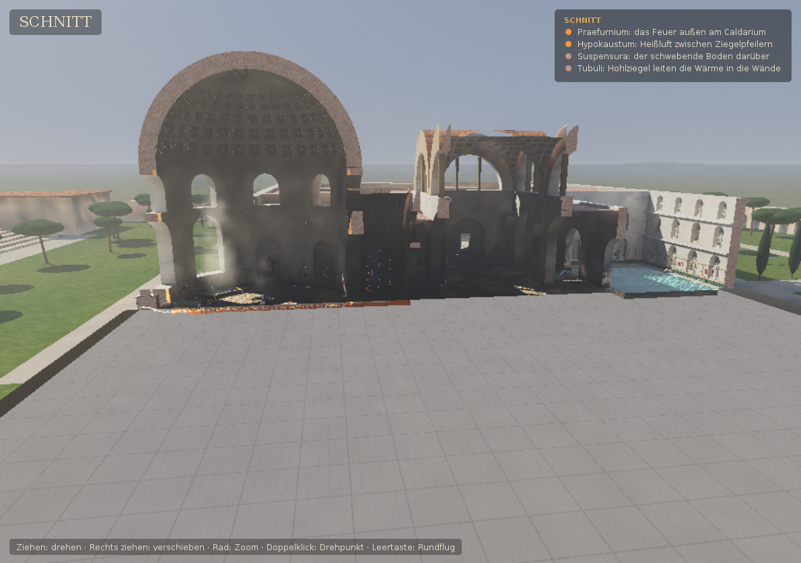 | 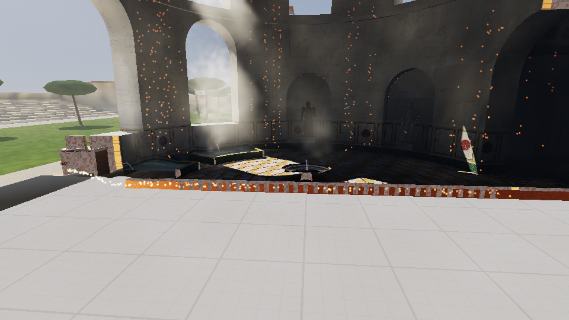 |

**Heute und 216.** Ein Regler lässt die Zeit laufen:

- Die Gewölbe stürzen ein.
- Die Mauern brechen ab.
- Der Marmor ist fort, das Ziegelmauerwerk liegt offen.
- Die Becken liegen trocken, Gras wächst in den Sälen.

Am Regler erscheinen die Ereignisse der Baugeschichte.

| | | |
|---|---|---|
| 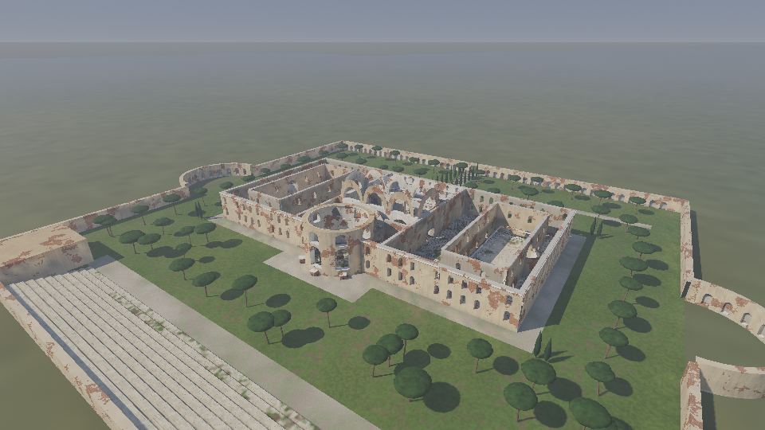 | 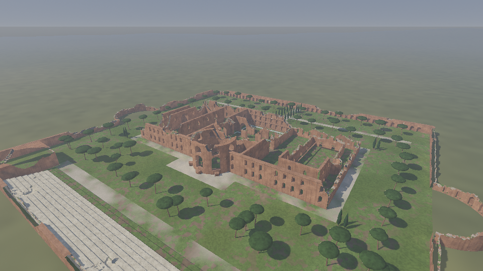 | 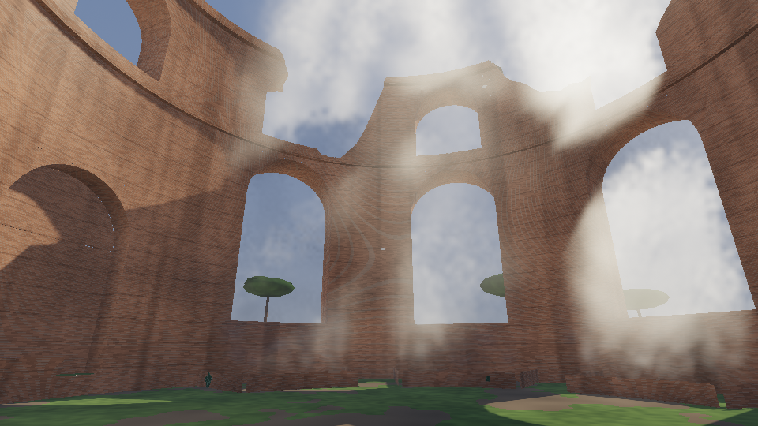 |

**Wasserweg.** Leuchtende Teilchen folgen dem Wasser. Es kommt über die Aqua Antoniniana, fließt durch die Zisternen und die Bleirohre unter dem Garten und gelangt über die Kessel der Praefurnien bis in die Becken. Dazu gibt es die Fahrt „Dem Wasser folgen“.

**Wärmebild.** Es zeigt die Temperaturen nach Saal, Tages- und Jahreszeit. Die Skala stellt sich auf die Außentemperatur ein.

**Klang.** Plätschern, Tropfen, Feuer, Wind und heute Vogelrufe werden laufend synthetisch erzeugt. Der Hall hängt vom Saal ab: Unter der Kuppel klingt jeder Tropfen sechs Sekunden nach.

| | | |
|---|---|---|
| 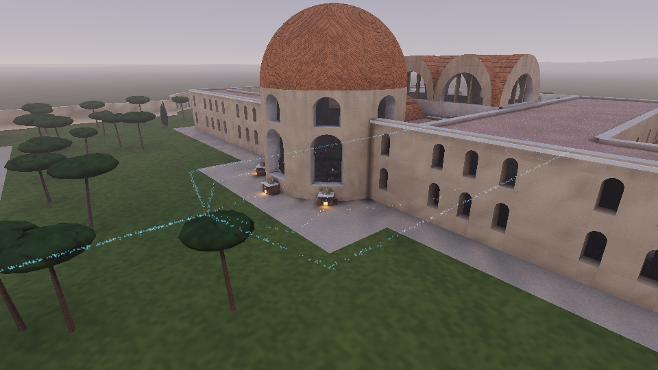 | 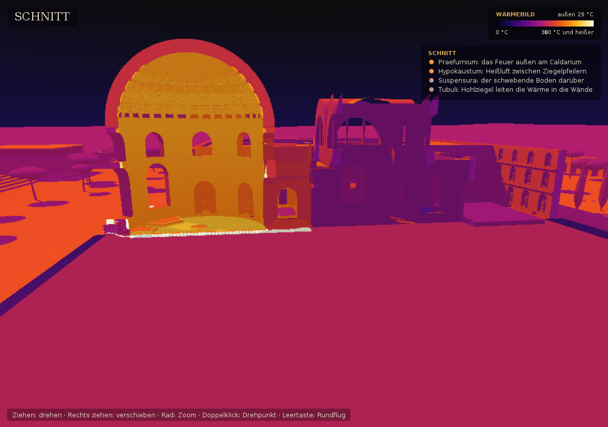 | 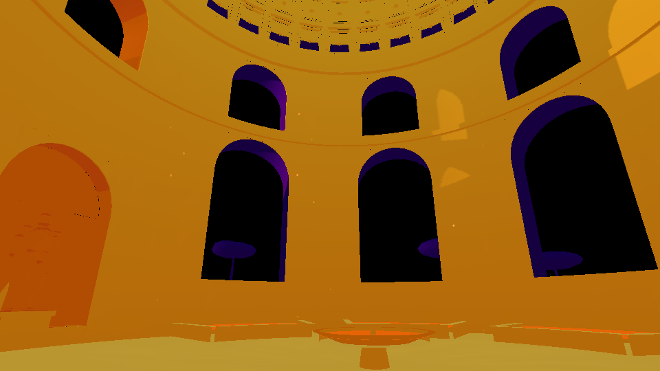 |

## Datenbank

Die App läuft auch ohne Datenbank. Mit Oracle (getestet mit 21c, Schema mit Präfix `CAR_`) kommen Fahrten, Rundgang und Drehbuch aus der Datenbank, und es gibt mehr zu sehen:

- **Steckbrief:** Ein Klick auf Marmor, Granit oder Porphyr zeigt Herkunft, Steinbruch und den Transportweg nach Rom auf einer kleinen Karte. Die Brüche und Wege sind als `SDO_GEOMETRY` in SRID 8307 gespeichert.
- **Baugeschichte:** 22 Ereignisse mit Quelle erscheinen am Zeitregler.
- **Säle:** Funktion, Temperaturen und Nachhall.
- **Gemerkte Blicke:** Man kann Blicke speichern und aus ihnen eigene Fahrten machen.

| | |
|---|---|
| 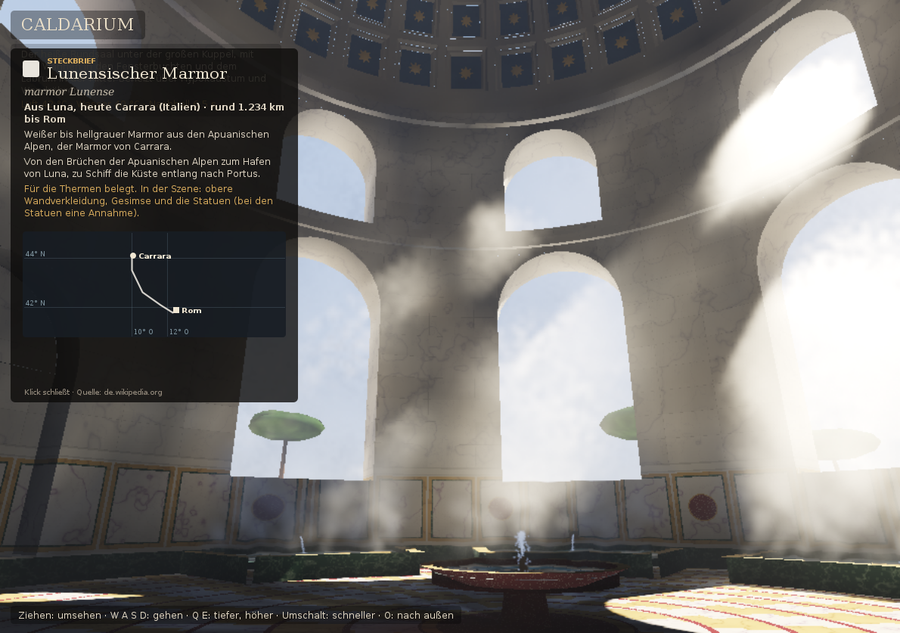 | 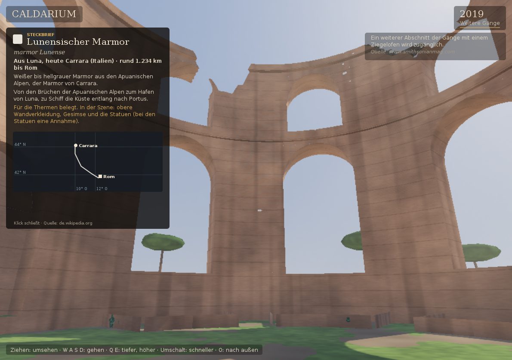 |

**Einrichten:**

1. `db/db.properties` anlegen:
   ```properties
   url=jdbc:oracle:thin:@//localhost:1521/PDBORCL
   user=DEMO
   password=…
   ```
2. In NetBeans `src/com/dan/caracalla/db/DbSetup.java` mit „Run File“ ausführen. Er führt `db/01_tabellen.sql`, `02_inhalte.sql` und `03_regie.sql` aus, prüft danach alles und schreibt das Protokoll nach `db/einrichtung.txt`.
3. Mit dem Argument `neu` baut `DbSetup` vorher alles mit `CAR_` ab, mit `pruefen` prüft er nur.

Die Skripte laufen auch in SQL*Plus oder SQL Developer, weil jede Anweisung mit `/` endet. Mehr dazu steht in `db/LIESMICH.txt`.

## Bedienung

| Taste | Wirkung |
|---|---|
| Maus ziehen, rechts ziehen, Rad | drehen, verschieben, Zoom |
| Doppelklick | neuer Drehpunkt |
| W A S D, Q E, Umschalt | innen gehen, tiefer und höher, schneller |
| 1 bis 5, 0, O | Säle, Übersicht, nach außen |
| Leertaste | Rundflug |
| F5, T, Esc | Drehbuch, Rundgang, anhalten |
| X, Z, I, L, M | Schnitt, 216 oder heute, Wärmebild, Wasserweg, Klang |
| P | Standbild in doppelter Auflösung nach `Bilder/Caracalla` |
| K oder F11 | Kinomodus |
| F1 oder H | alle Tasten |

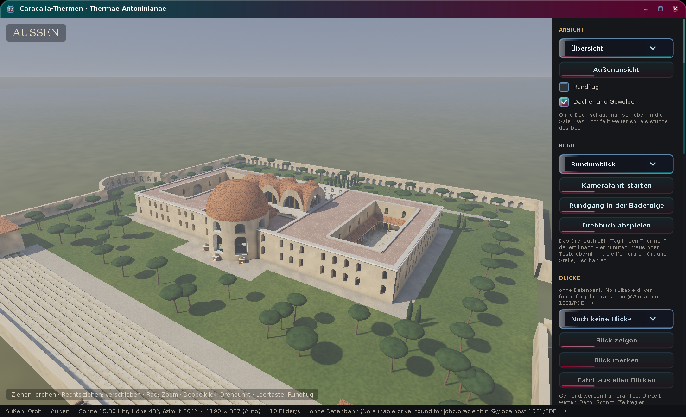

| | |
|---|---|
| 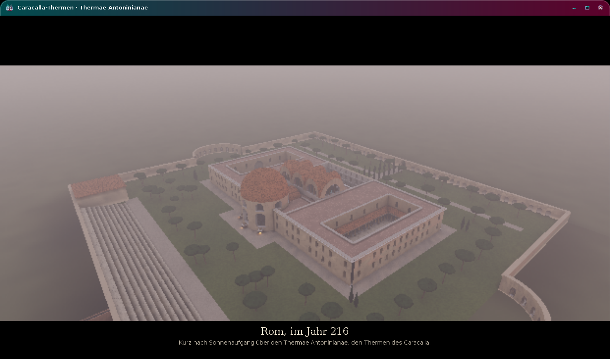 | 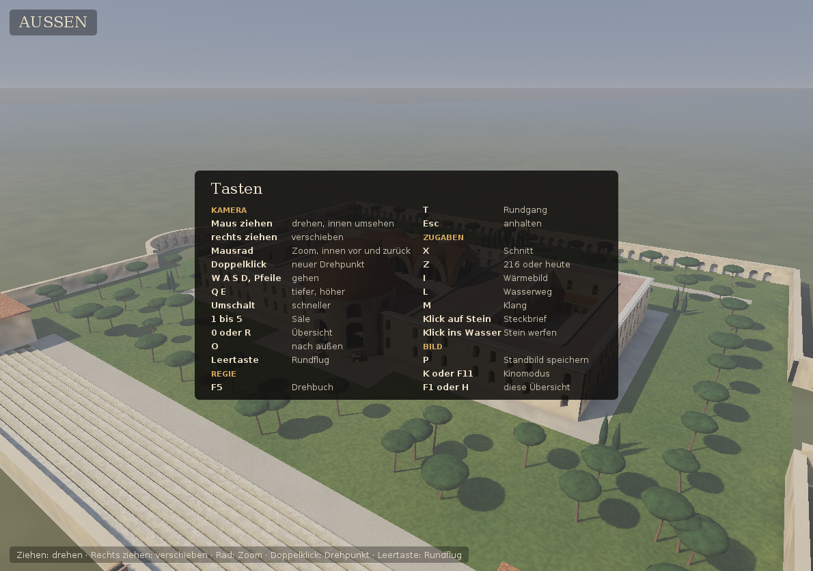 |

## Bauen und starten

- **Werkzeuge:** JDK 21 und NetBeans (Ant). Das Projekt öffnen und starten; die Hauptklasse ist `com.dan.caracalla.CaracallaApp`.
- **Bibliotheken in `lib/`:**
  - `FStyle.jar`: Oberfläche aus `com.dan.*` mit FFrame, FButton, FSlider, FComboBox, FScrollBar und FOptionPane.
  - `ojdbc11.jar`: nur für die Datenbank.
- **Speicher:** Die App braucht 4 GB (`-Xmx4g`, steht in den Projekteinstellungen).
- **Erster Start:** Die Himmelssicht wird einmal berechnet und unter `~/.caracalla/` zwischengespeichert.

**Werkzeuge im Paket `tools`:**

| Klasse | Zweck |
|---|---|
| `StillRender` | Standbilder ohne Fenster |
| `ScriptFrames` | Bilder aus dem Drehbuch |
| `PathCheck` | prüft, dass keine Kamerafahrt durch Wände geht |
| `SoundTest` | Klang als WAV-Datei |
| `DbBestand` | Bestandsaufnahme im Schema, nur lesend |
| `RegieExport` | Fahrten als SQL |
| `GuiShot` | Bedienungstest mit Bildschirmfotos |

## Technik

Es gibt keine GPU-Shader und keine 3D-Bibliothek. Alles läuft als Java-Code auf dem Prozessor, parallel in Streifen:

- **Rasterung:** in einen G-Puffer mit Tiefe, Normale, Material, Himmelssicht und zurückgeworfenem Licht; Nahebenen-Clipping, Sichtprüfung je Block.
- **Beleuchtung je Pixel:**
  - zwei orthografische Schattenkarten mit weichen Rändern
  - Himmelslicht aus einer BVH-Vorberechnung mit 48 Strahlen je Ecke
  - einmaliger Lichtrückwurf, geglättet über ein Umgebungswürfel-Gitter
  - Glanz und prozedurale Materialien
- **Wasser:** Höhenfelder je Becken, Spiegelung im Bildraum, Brechung, Lichtnetze.
- **Dampf:** Teilchen in einem divergenzfreien Strömungsfeld, Dichtegitter für die Strahlen, weiche Schwaden, Hitzeflimmern.
- **Volumetrik:** Strahlengang in Viertelauflösung mit Henyey-Greenstein-Phase, tiefenbewusst weichgezeichnet und hochskaliert.
- **Nachbearbeitung:** Bloom, Belichtungsautomatik, ACES-Filmkurve.
- **Schnitt und Ruine:** Rückseiten werden nur dort als Schnittfläche gefüllt, wo der Blick durch weggenommenes Volumen geht.
- **Klang:** Blasenresonanzen nach Minnaert und ein Hall nach Freeverb-Art. Die Nachhallzeit hängt vom Saal ab.
- **Qualität Auto:** hält das Bild in Bewegung flüssig und rechnet im Stillstand in voller Auflösung.

## Projektaufbau

```
src/com/dan/caracalla/
  CaracallaApp.java   Einstieg, FFrame
  geo/                Netzaufbau: Mauern mit Öffnungen, Gewölbe, Kuppeln, Säulen, Statuen, Bäume
  model/              der Bau: ThermenModel, Hypocaust, WaterSupply, Säle, Becken, Wege
  render/             Renderer, Schatten, Himmel, BVH, Materialien, Wasser, Dampf, Ruine, Wärmebild
  regie/              Kamerapfade, Einstellungen, Zeitleisten, Programm
  ui/                 Szene, Kamerasteuerung, Bedienfeld
  audio/              synthetischer Klang
  db/                 Datenbankzugriff und Einrichter
  tools/              Werkzeuge (siehe oben)
db/                   SQL-Skripte, LIESMICH.txt, gen/inhalte.py
docs/bilder/readme/   Bilder dieser Seite
docs/bilder/entwicklung/  alle Test- und Prüfbilder aus der Entwicklung, nach Arbeitsschritten
```

## Zur Rekonstruktion und Quellen

**Gut belegt** sind Grundriss, Maße, die Lage der Säle und die Heizung. **Deutung** sind die genaue Form der Kuppel, die Fensterteilung und die Verteilung der Marmorsorten. Die Szene folgt den gängigen Rekonstruktionen und trifft dort, wo Befunde fehlen, eine plausible Wahl. Die Ruine im Zeitregler ist frei erzeugt: Sie zeigt den Charakter der heutigen Anlage, nicht jede einzelne Mauer.

Bei den Steinen ist für die Thermen belegt: Pavonazzetto, Giallo antico, Porphyr, Serpentin, lunensischer und prokonnesischer Marmor sowie ägyptischer Granit. Verde antico und Travertin kommen nur in der Szene vor. Jede Zeile in der Datenbank nennt ihre Quelle.

- [Baths of Caracalla (Wikipedia)](https://en.wikipedia.org/wiki/Baths_of_Caracalla)
- [Caracalla-Thermen (Wikipedia)](https://de.wikipedia.org/wiki/Caracalla-Thermen)
- [Soprintendenza Speciale di Roma: Terme di Caracalla](https://soprintendenzaspecialeroma.it/luoghi/terme-di-caracalla/)
- [Ostia Antica: The Baths of Caracalla, building history](https://www.ostia-antica.org/caracalla/italy/baths-building.htm)
- [Vici.org](https://vici.org/vici/7894/?lang=en)
